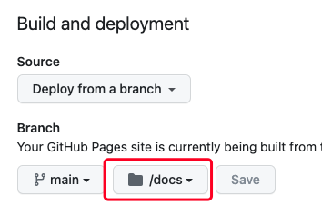

# fintech-path.github.io

## hexo

- 本工程是基于 hexo 构建，具体使用方法请访问链接: <https://hexo.io/docs/>

## github 工程配置

- 在工程 settings > pages 设置中将 构建目录选为 docs 目录
  


## 安装

这是一个 node 工程，首先确保你已经安装了 [Node.js](https://nodejs.org/) 环境。

- 初始化，只需要运行一次。

```bash
# 全局安装 pnpm
npm install -g pnpm

# 全局安装 hexo cli
pnpm install -g hexo-cli

# 安装依赖
pnpm install
```

- 本地调试
  
```bash
pnpm run dev
```

- 构建: **注意，这是发布前必要步骤**。每次更新或添加了文章，如要发布的话需要重新构建 /docs 目录（静态文件 ） **docs 目录才是 github 上真正托管的 blog**
  
```bash
pnpm run build
```

- 发布

```bash
git commit -m '[some comments]'
git push
```

## How to

- 以 markdown 格式编写文章并放到 source/_posts 目录下。
- 把以下格式内容放到文章头部（替换成你想要的信息）

```bash
---
title: React Hooks
date: 2023-03-16 16:45:17
toc: true
tags: 
    - react.js
    - 前端
categories:
    - 前端
---
```

- 然后运行上面提到的“构建”和“发布”步骤
- 打开 blog 网址查看结果。临时网址是：<https://fintech-path.github.io/>

总结： 在 source/_post 目录下编写 md -> 构建 -> git commit & push
