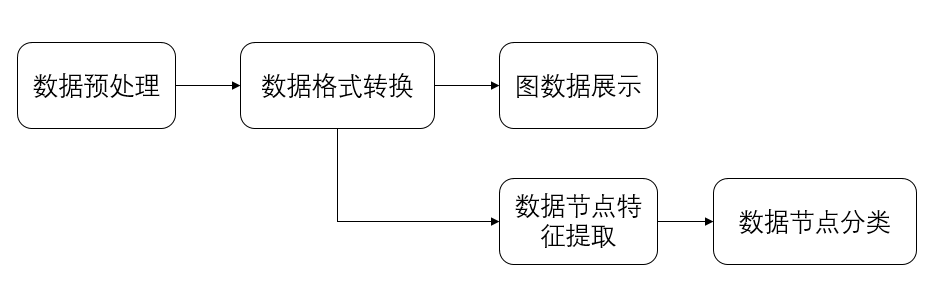
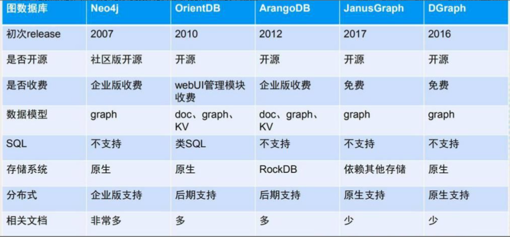
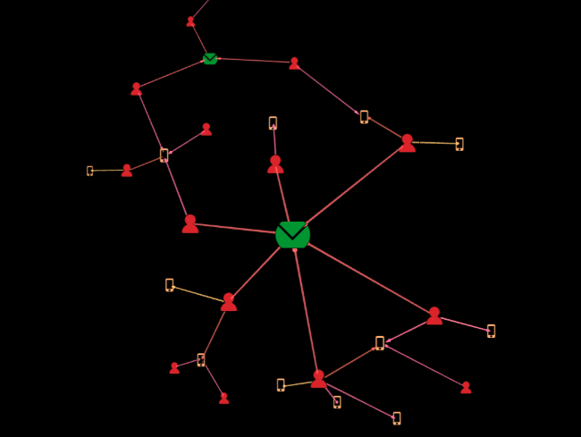
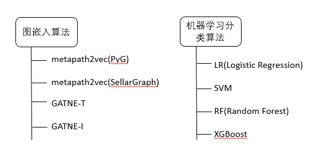
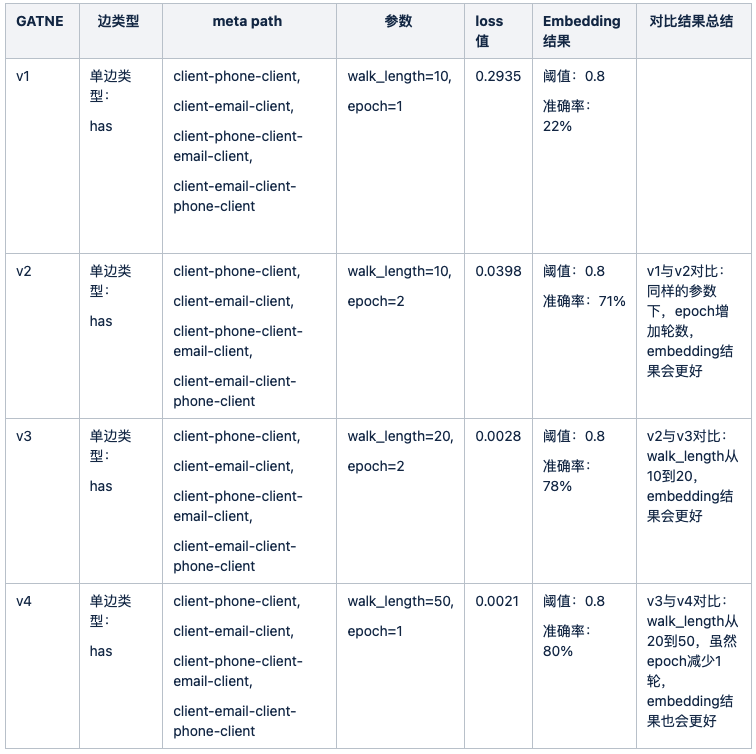
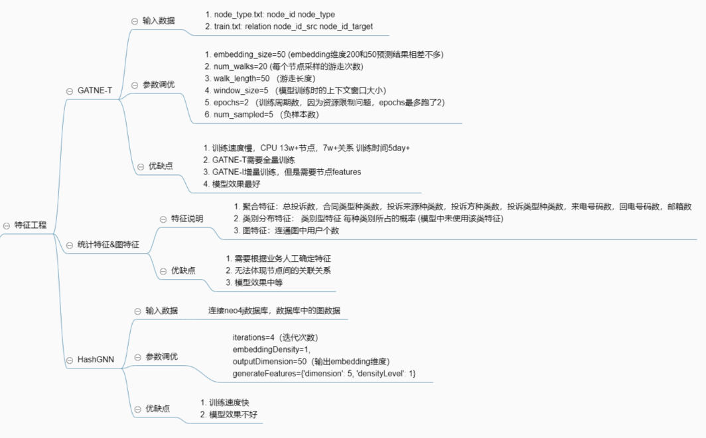
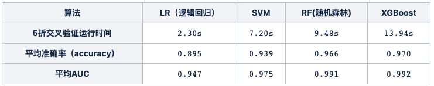
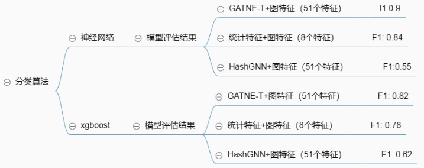

## 问题背景
在处理投诉过程中公司监测到投诉人存在非法代理虚假投诉现象，疑似非法代理人/机构以所谓征信洗白、伪造证明材料、向监管机构缠访、闹访等赚取不当利益的代理行为，协助客户与公司协商，要求处理合同相关问题（包括但不限于删除逾期征信，减免息费），非法代理行为不仅危害公司利益且易引发更多的恶意投诉。
针对此问题本项目通过业务部门采集的客户投诉电话号码以及投诉人提供的接受资料的电子邮箱等信息来判断客户是否为代理人员。
我们采用图数据的形式整理展现数据，让本来略显杂乱的数据直观的展现出来。非技术人员也能通过图的展示轻易找到并准确判断哪些客户是代理人员。并且通过图嵌入算法将图中的节点以向量形式表达，供给机器学习模型作为特征使用，实现了较为准确的分类。
通过分类鉴别代理人员，将结果反馈给相关业务人员。可以提高服务的效率并提升服务质量。

## 解决方案
整合原始数据，将整理后的数据按照图数据库的要求进行数据转换，将处理好的数据通过专用的图数据软件工具（Neo4j）做直观展示。
同时对图数据的节点做特征提取（Embedding），最后可以将提取好的特征做分类算法，从而判断是否为代理人。
如下图所示：

### 图数据库选型
鉴于本项目的数据存放，特征提取以及基本关系展示都利用到了图数据库，选择一个合适的技术方案是否重要。
如下是目前流行的几个具备开源版本的图数据库：

考虑到初始化的研发投入，社区支持，工具丰富度等因素，以及对于未来大规模企业化应用的支持，我们选择了Neo4j。

<!--more-->

### 数据处理和格式转换
图数据库中有不同类型的节点，如邮件，电话，客户，节点之间存在关联，表示某一客户通过某一电话来电投诉，或留下某一邮件地址作为后续联络方式等：

对于业务人员记录的邮箱信息，会有部分信息遗漏造成数据缺失的问题，我们通过从邮件的原始信息中，用正则匹配的方式来提取用户的邮箱信息，来对邮箱数据进行补充。

### 模型训练
我们采取两步走的方式，首先根据图结构训练图中每个节点的embedding向量，然后将embedding向量结果提供给后续机器学习分类模型作为特征使用。
本着从易到难的路径，我们对不同的图嵌入（Embedding）算法和分类算法分别进行了尝试：

#### 图嵌入算法 vs 统计特征
基于图嵌入算法生成的embedding向量可以计算每一对节点的相似度，相似度越大则两个节点之间越有可能产生连接。
对于我们的异构图模型，目标是要进行用户节点的分类，所以只需比较每一对用户节点的相似度，两用户节点间跳数越少，相似度越大。
因此我们利用embedding计算出的余弦相似度作为用户节点对的score，选择score阈值0.8。针对某一个用户，记录该用户所在的连通图中关联的所有用户数total_u，并计算出与该用户相似度score>=0.8且在连通图的所有用户数top_u。
选择多组用户的准确率avg(sum(top_u/total_u))作为评估指标，对embedding进行评估。

我们首先选择适用于异构图的经典图嵌入算法metapath2vec，并分别使用两个图算法框架SellarGraph和Pytorch Geometric来实现该算法。
算法首先要在图中选取由节点类型构成的组合路径，基于meta path在图上进行随机游走。但是基于PyG实现的metapath2vec目前只支持单一meta path，训练结果embedding结果不佳。基于StellarGraph实现的metapath2vec可以支持multi-meta path，但是训练的loss值过高，无法使用。
后续又尝试了阿里的GATNE异构图Embedding算法。GATNE算法包括两种：GATNE-T和GATNE-I。

GATNE(General Attributed Multiplex HeTerogeneous Network Embedding)算法模型获取了丰富的属性信息并且利用了不同节点的多重拓扑结构。
GATNE的主要特点如下：
① 定义了属性复用异构图嵌入问题；
② GATNE支持直推式学习（GATNE-T）和归纳式学习（GATNE-I）。并且理论证明了本文的直推式模型比现有的模型更一般化；
③ 有很好的可扩展性，可处理上亿级别的节点和十亿级别的边。

GATNE-T的embedding再经过数轮的调优后，结果可用。
以下是GATNE-T的调优结果：

但是GATNE-T不能单独为新加入的节点生成Embedding，也就是不能使用训练集训练好的参数，用户生成（训练时不可见的）测试集的节点嵌入表示，必须重新训练。由于计算资源的限制（没有GPU），每次重新训练需要5天之久，完全不能满足业务需求。
为此，我们还尝试了neo4j提供的HashGNN，训练时间可以满足，但是模型效果不好。
在模型效果和时效性上，GATNE-T和HashGNN让我们陷入了两难的境地。只能另寻出路，尝试传统的统计聚合类型的特征+图特征。
这三种特征提取方案的比较如下：

最终上线模型没有采用Embedding算法来计算用户特征，而是使用了传统的统计聚合类型的特征+图特征来替换了Embedding特征。

#### 分类算法
本项目要解决的问题目标是判断用户是否为投诉代理，所以可以看成是二分类问题。
除了模型使用的测试数据，又使用近2个月新数据作为验证数据，对模型进行了验证。但是模型对于新数据的预测结果不理想，模型泛化能力较弱。考虑是正负样本数据不均衡原因导致，使用SMOTE算法构建新的少数类样本，评测指标有所提升。
分类算法特征：得到图嵌入模型生成的n维（我们模型是200维）后，直接用这200维特征作为机器学习分类算法的特征。
分类算法的分类标签：一是业务标记的代理，二是有共用电子邮箱（提供接受资料的邮箱）的用户标记为代理。
我们选取了四种机器学习算法模型进行了测试：LR, SVM, RF, XGBoost。
样本总数量：67520
代理样本（标签为1）数量：1735
非代理样本（标签为0）数量：65785
评估指标：AUC和准确率
对比测试结果：

XGBoost胜出！

对于特征提取算法+分类算法所产生的结果，我们使用F1 Score来进行评估，要求不低于0.8才能上线。鉴于使用统计特征+图特征所带来的相对于GATNE-T的减分（F1 Score：0.78），我们又将神经网络引入，结合前述的三类特征提取算法，有了如下比较：

可以看出，利用较少的统计特征+图特征进行特征提取，后续使用神经网络进行分类，即满足了计算结果的时效性，也能提供一个比较不错的结果（F1 Score： 0.84）。

